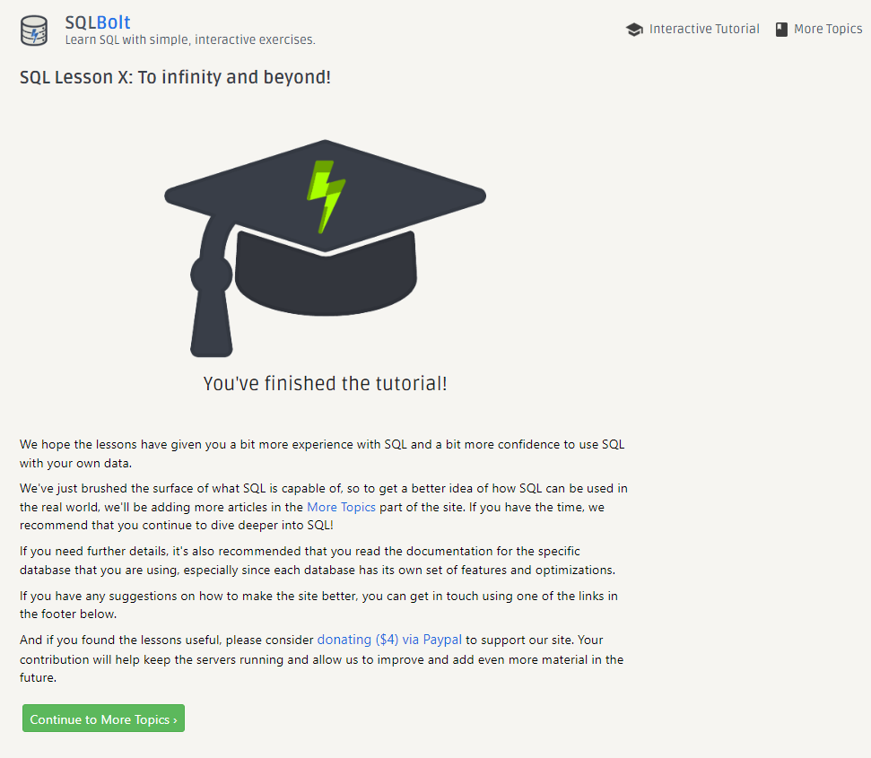

# Introduction to SQL

#### Relational databases are a powerful type of database management system that organize data into tables with columns and rows.
#### These tables are interconnected through shared fields, enabling efficient storage and retrieval of information.

---

#### SQL is a programming language specifically designed for working with relational databases. 
#### It allows users to create, modify, and retrieve data from databases to gain insights and make informed decisions. 
#### This book provides a solid grounding in the fundamentals of SQL, covering essential topics such as table creation, data insertion, and querying data using the SELECT statement.

---

#### Moreover, the book delves into advanced SQL concepts such as filtering and sorting data, joining tables, and using functions to aggregate data. 
#### It also stresses the importance of database design and offers practical examples that demonstrate how to create and manage relational databases using SQL.

#### Furthermore, the book explores important topics like transactions, locking, and performance optimization that are critical for database administrators and developers to understand.

---

#### Overall, "Learn SQL" is a comprehensive guide to relational databases and SQL, making it an invaluable resource for both beginners and experienced users looking to enhance their knowledge and skills.

---

#### in the end, 
#### I recommend [SQL-Bolt](https://sqlbolt.com/), which is a series of interactive lessons and exercises designed to help you quickly learn SQL right in your browser.
#### and [here](https://github.com/Esmail-Jawabreh/SQL-Bolt) youc find my answers.

---

--- 

**- Esmail Jawabreh**